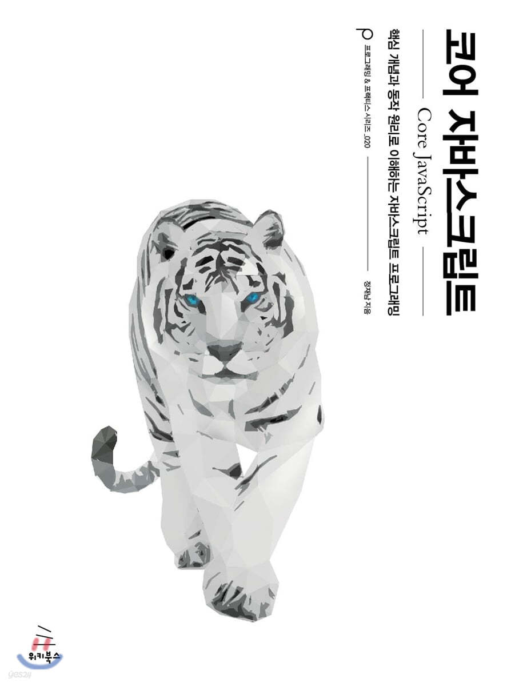
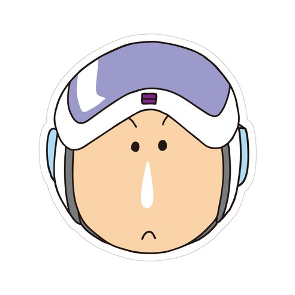

<div align="center">

# 📚 [코어 자바스크립트] 북 스터디 📚

|  |
| --------------------------------------------------------- |


<br />

## 📣 진행 방식 📣

<div align="left">

- 스터디는 주 1회 (수 21:00 - 22:00) 진행됩니다.
- 스터디는 책의 챕터를 기준으로 분류됩니다. 스터디원 모두는 스터디 진행 전까지 해당되는 챕터를 읽어옵니다.
- 챕터의 담당자는 스터디 진행 전까지 내용 정리를 진행합니다.
- 정리본은 markdown으로 작성하고 제목은 담당자의 이름입니다.
  - 챕터 명으로 만들어진 브랜치를 사용합니다. (ex. 1.data-type)
  - 챕터 명으로 만들어진 폴더에 업로드합니다. (ex. [1장] 데이터 타입/신짱구.md) 그리고 README에 업로드된 정리본을 연결해줍니다.
  - PR을 통한 리뷰를 진행. 모두의 승인을 받으면 main 브랜치로 merge를 진행합니다.
  - commit message
    ```
    🧑‍💻 : [?장] ?챕터명? - ?이름?
    🖇️ : [?장] ?챕터명? - 정리본 연결
    ✏️ : [?장] ?챕터명? - 오탈자 수정
    📝 : 리드미 수정
    ```
- 챕터의 담당자를 제외한 나머지 스터디원은 문제를 준비합니다.
  - [GitHub issue](https://github.com/Coding-Village-Protector/core-js/issues)로 해당 챕터의 label을 적용하여 문제를 작성합니다. 양식은 제공되는 템플릿을 준수합니다.
  - 문제는 스터디 진행 전날부터 진행 직전까지 등록합니다.
  - 문제 출제자를 제외한 나머지 스터디원은 문제가 등록된 시점부터 스터디 진행 30분 시점까지 문제에 대한 답안을 답변으로 작성합니다.
- 스터디는 1시간 동안 진행됩니다.
  - 전반 30분 동안 다 함께 정리본을 읽고 챕터에 대한 질의응답을 진행합니다.
  - 후반 30분 동안 출제된 문제와 답변을 확인합니다. 출제자는 issue에 마지막 순서로 최종 답안을 작성하면서 해당 issue를 종료시킵니다.

</div>
<br />

## 📅 일정표 📅

<table>
<tbody>
<tr>
<td align="center" colspan="5">0주차</td>
</tr>
<tr>
<td align="center">2/13(화)</td>
<td colspan="4">OT</td>
</tr>
<tr>
<td align="center" colspan="5">1주차</td>
</tr>
<tr>
<td align="center">2/21(수)</td>
<th align="left">[1장] 데이터 타입</th>
<td>정리</td><!-- 정리본.md <a>로 연결 -->
<td><a href="https://github.com/Coding-Village-Protector/core-js/issues?q=label%3A%22%5B1%EC%9E%A5%5D+%EB%8D%B0%EC%9D%B4%ED%84%B0+%ED%83%80%EC%9E%85%22+is%3Aclosed">문제</a></td>
<td>이성령</td>
</tr>
<tr>
<td align="center" colspan="5">2주차</td>
</tr>
<tr>
<td align="center">2/28(수)</td>
<th align="left">[2장] 실행 컨텍스트</th>
<td>정리</td><!-- 정리본.md <a>로 연결 -->
<td><a href="https://github.com/Coding-Village-Protector/core-js/issues?q=label%3A%22%5B2%EC%9E%A5%5D+%EC%8B%A4%ED%96%89+%EC%BB%A8%ED%85%8D%EC%8A%A4%ED%8A%B8%22+is%3Aclosed">문제</a></td>
<td>채하은</td>
</tr>
<tr>
<td align="center" colspan="5">3주차</td>
</tr>
<tr>
<td align="center">3/6(수)</td>
<th align="left">[3장] this</th>
<td>정리</td><!-- 정리본.md <a>로 연결 -->
<td><a href="https://github.com/Coding-Village-Protector/core-js/issues?q=label%3A%22%5B3%EC%9E%A5%5D+this%22+is%3Aclosed">문제</a></td>
<td>이성령</td>
</tr>
<tr>
<td align="center" colspan="5">4주차</td>
</tr>
<tr>
<td align="center">3/13(수)</td>
<th align="left">[4장] 콜백 함수</th>
<td>정리</td><!-- 정리본.md <a>로 연결 -->
<td><a href="https://github.com/Coding-Village-Protector/core-js/issues?q=label%3A%22%5B4%EC%9E%A5%5D+%EC%BD%9C%EB%B0%B1+%ED%95%A8%EC%88%98%22+is%3Aclosed">문제</a></td>
<td>강지윤</td>
</tr>
<tr>
<td align="center" colspan="5">5주차</td>
</tr>
<tr>
<td align="center">3/20(수)</td>
<th align="left">[5장] 클로저</th>
<td>정리</td><!-- 정리본.md <a>로 연결 -->
<td><a href="https://github.com/Coding-Village-Protector/core-js/issues?q=label%3A%22%5B5%EC%9E%A5%5D+%ED%81%B4%EB%A1%9C%EC%A0%80%22+is%3Aclosed">문제</a></td>
<td>이에스더</td>
</tr>
<tr>
<td align="center" colspan="5">6주차</td>
</tr>
<tr>
<td align="center">3/27(수)</td>
<th align="left">[6장] 프로토타입</th>
<td>정리</td><!-- 정리본.md <a>로 연결 -->
<td><a href="https://github.com/Coding-Village-Protector/core-js/issues?q=label%3A%22%5B6%EC%9E%A5%5D+%ED%94%84%EB%A1%9C%ED%86%A0%ED%83%80%EC%9E%85%22+is%3Aclosed">문제</a></td>
<td>이예솔</td>
</tr>
<tr>
<td align="center" colspan="5">7주차</td>
</tr>
<tr>
<td align="center">4/3(수)</td>
<th align="left">[7장] 클래스</th>
<td>정리</td><!-- 정리본.md <a>로 연결 -->
<td><a href="https://github.com/Coding-Village-Protector/core-js/issues?q=label%3A%22%5B7%EC%9E%A5%5D+%ED%81%B4%EB%9E%98%EC%8A%A4%22+is%3Aclosed">문제</a></td>
<td>채하은</td>
</tr>
</tbody>
</table>

<br />

## 🤓 스터디원 🤓

<table>
<tbody>
<tr>
<td align="center"></td>
<td align="center"></td>
<td align="center"></td>
<td align="center"></td>
<td align="center"></td>
</tr>
<tr>
<th align="center">강지윤</th>
<th align="center">이예솔</th>
<th align="center">이성령</th>
<th align="center">이에스더</th>
<th align="center">채하은</th>
</tr>
<tr>
<td align="center" width="120"><a href="https://github.com/eeeyooon">@eeeyooon</a></td>
<td align="center" width="120"><a href="https://github.com/lulla-by">@lulla-by</a></td>
<td align="center" width="120"><a href="https://github.com/sryung1225">@sryung1225</a></td>
<td align="center" width="120"><a href="https://github.com/Stilllee">@Stilllee</a></td>
<td align="center" width="120"><a href="https://github.com/chaehaeun">@chaehaeun</a></td>
</tr>
</tbody>
</table>

</div>
