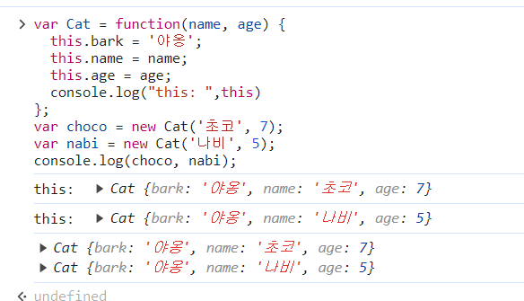

# this
> 함수와 객체(메서드)의 구분이 느슨한 자바스크립트에서 이 둘을 구분하게하는 거의 유일한 기능이다

## 01. 상황에 따라 달라지는 this

자바스크립트에서의 this는 실행 컨텍스트가 생성될 때 함께 결정된다. 실행 컨텍스트는 함수를 호출할 때 생성되므로 **this는 함수가 호출할 때 결정**되는데, 그 함수를 **어떻게** 호출하느냐에 따라서 this의 값이 달라지는 것이다.

### 1) 전역 공간에서의 this

전역공간에서의 this는 전역 객체를 가리킨다. 전역 컨텍스트가 생성하는 주체가 전역 객체이기 때문.

- 브라우저 환경에서의 전역객체는 window
- Node.js 환경에서는 전역객체는 global

전역 변수를 선언하면 자바스크립트 엔진은 이 변수를 전역 객체의 프로퍼티로 할당

```js
var a = 1;
console.log(a); // 1
console.log(window.a); // 1
console.log(this.a); // 1
```

전역공간에서 선언한 변수 a에 1을 할당할 경우 window 객체와 this로 접근이 가능하다.

그 이유는 자바스크립트의 모든 변수는 특정 객체의 프로퍼티로 동작하고 여기서의 특정 객체가 바로 LexicalEnvironment(L.E)이기 때문이다.

어떤 변수를 호출하면 L.E를 조회해서 일치하는 프로퍼티를 찾고 반환함. 전역 컨텍스트의 L.E는 전역객체를 그대로 참조한다.

따라서 전역변수를 선언하면 자바스크립트 엔진은 이를 전역객체의 프로퍼티로 할당하는 것이다.

여기에서 그냥 a를 호출해도 1이 나오는 이유는 스코프체인으로 a를 찾다가 가장 상위에 있는 전역 스코프의 L.E에서 해당 프로퍼티를 발견하여 그 값을 반환하기 때문이다.

이쯤되면 전역 공간에서 var로 변수를 선언하는 것이나 window 객체의 프로퍼티에 직접 값을 할당하는 것이나 똑같이 동작할 것을 예상할 수 있다.

하지만 `delete(삭제)` 명령에서는 똑같이 작동하지 않는다.

```js
var a = 1;
delete window.a; // false
console.log(a, window.a, this.a); // 1 1 1

var b = 2;
delete b; // false
console.log(b, window.b, this.b); // 2 2 2

window.c = 3;
delete window.c; // true
console.log(c, window.c, this.c); // Uncaught ReferenceError: c is not defined

window.d = 4;
delete d; // true
console.log(d, window.d, this.d); // Uncaught ReferenceError: d is not defined
```

예제에서 전역 변수로 선언한 경우(var 사용)에는 `delete`를 시도하면 false로 나온다. 반면 window 객체의 프로퍼티로 직접 할당한 경우(window.)에는 삭제가 가능하다.

이는 사용자의 의도치 않은 삭제를 방지하기 위한 차원이다.

전역 변수를 선언하면 자바스크립트 엔진이 자동으로 전역객체의 프로퍼티로 할당하는데 이 과정에 추가적으로 configurable 속성을(변경 및 삭제 가능성) false로 정의한다.

그렇기 때문에 전역 변수를 활용한 방식에서는 `delete` 명령어를 사용한 삭제는 불가능하다.

<br/>

### 2) 메서드로서 호출할 때 그 메서드 내부에서의 this

함수를 실행하는 방법에는 여러가지가 있다. 가장 일반적인 방법 두가지는 함수로서 호출하는 경우와 메서드로서 호출하는 경우다. 이 둘을 구분하는 차이는 **독립성**으로 이는 함수는 그 자체로서 독립적인 기능을 수행하지만 메서드는 자신을 호출한 대상 객체에 관한 동작을 수행한다는 것이다.

이때 자바스크립트는 상황별로 this키워드에 다른 값을 부여하게 함으로써 이를 구현했다. 흔히들 메서드를 객체의 프로퍼티에 할당된 함수로 이해하는데 이는 완벽하게 맞는 문장이 아니다.

더 정확하게는 **객체의 메서드로서 호출한 경우**에만 메서드이고, 그렇지 않으면 함수다.


```js
var func = function(x) {
  console.log(this, x);
};
func(1); // Window { ... } 1

var obj = {
  method: func,
};
obj.method(2); // { method: f } 2
```
func라는 변수에 익명함수를 할당했다. 이후 func함수를 obj의 method라는 프로퍼티에 할당한 코드다.
이때 이 함수를 직접 호출하면 this는 window를 가리킨다. 반면 obj의 method를 호출하는 방식으로 사용하면 this는 method 객체를 가리키는 것을 확인할 수 있다.

변수에 담아서 호출한 경우와 obj객체의 프로퍼티에 할당하여 호출한 경우 this가 차이를 보이는 것이다.

함수로서의 호출과 메서드로서의 호출은 구분법이 간단하다. 바로 함수 앞에 점(.)이 있는가 없는가에 따라 있으면 메서드, 없으면 함수 호출이다.

점 표기법이든 대괄호 표기법이든 함수를 호출할 때 함수 이름 앞에 객체가 명시되어 있다면 메서드로 호출한 것이다.

this에는 호출한 주체에 대한 정보가 담긴다. 메서드 호출은 해당 메서드를 호출한 주체, 즉 점 앞에 있는 객체가 this가 된다.

```js
var obj = {
  methodA: function() {
    console.log(this);
  },
  inner: {
    methodB: function() {
      console.log(this);
    },
  },
};
obj.methodA(); // { methodA: f, inner: {...} }    ( === obj)
obj['methodA'](); // { methodA: f, inner: {...} } ( === obj)

obj.inner.methodB(); // { methodB: f }            ( === obj.inner)
obj.inner['methodB'](); // { methodB: f }         ( === obj.inner)
obj['inner'].methodB(); // { methodB: f }         ( === obj.inner)
obj['inner']['methodB'](); // { methodB: f }      ( === obj.inner)
```

위의 코드에서 확인할 수 있듯이 메서드에서의 this는 호출한 객체를 가리킨다. obj.에서 methodA를 호출한 경우에는 obj가 this가 되고, obj.inner.에서 호출한 methodB는 obj.inner를 가리킨다.

<br/>

### 3) 함수로서 호출할 때 함수 내부에서의 this

어떤 함수를 함수로서 호출할 경우에는 this가 지정되지 않는다. 함수로서 호출하는 방식은 호출 주체를 명시하지 않고 개발자가 코드에 직접 관여하여 실행하는 것으로 호출 주체의 정보를 알 수 없다. 따라서 실행 컨텍스트를 활성화 하는 과정에서 this가 지정되지 않은 경우에는 this는 전역을 바라보므로 함수에서의 this도 앞서 설명한데로 호출 주체의 정보를 알 수 없기에 전역 객체를 가리키는 것이다.

메서드 내부에서 정의하고 실행한 함수의 this가 가장 혼란스러울 수 있는 부분이다. 하지만 어떤 함수를 메서드로서 호출할 때와 함수로서 호출할 때 this가 무엇을 가리키는지는 .을 통해 알 수 있다.


```js
var obj1 = {
  outer: function() {
    console.log(this);
    var innerFunc = function() {
      console.log(this); 
    };
    innerFunc(); //(2)

    var obj2 = {
      innerMethod: innerFunc,
    };
    obj2.innerMethod();//(3)
  },
};
obj1.outer();//(1)
```
각각의 함수 및 메서들 호출한 결과는 console로 찍히는 this는 다음과 같다.

(1) obj1

(2) window

(3) obj2


this 바인딩에 관해서는 함수를 실행하는 당시의 주변 환경은 중요하지 않다. 오직 해당 함수를 호출하는 구문 앞에 점 또는 대괄호 표기가 있는지만 중요하다. 

obj1의 프로퍼티로서 호출한 outer함수는 메서드로 this는 obj1을 가리킨다. obj2의 프로퍼티로서 호출한 innerMethod 역시 this를 호출한 주체인 ojb2를 가리킨다. 오직 7번줄의 innerFunc()만 this를 window를 가리킨다.

하지만 스코프 체인과의 일관성을 지키는 방식들을 생각하면 함수로서 호출된다고 전역을 가리키는 방식은 다소 아쉽다. 호출 주체가 없을 경우 자동으로 전역객체를 바인딩하지 않고 호출 당시 주변 환경의 this를 상속 받아 사용한다면 좋을 것 같다는 생각이 드는 상황에서 이를 우회하는 방법이 있다.

es5까지는 자체적으로 내부 함수에 this를 바인딩하는 방식이 없지만 우회는 가능하다. 대표적인 방식은 다음과 같이 메서드 내부에서 변수에 this를 바인딩한 뒤 변수를 사용하는 방식이다.

```js
var obj = {
  outer: function() {
    console.log(this); // (1) { outer: f }
    var innerFunc1 = function() {
      console.log(this); // (2) Window { ... }
    };
    innerFunc1();

    var self = this;
    var innerFunc2 = function() {
      console.log(self); // (3) { outer: f }
    };
    innerFunc2();
  },
};
obj.outer();
```

self라는 변수에 this를 바인딩한뒤 innerfunc2에서 this대신 self를 사용한 경우다. 이때는 앞에  .이나 대괄호 없이 함수로서 호출을 하는 방식을 사용해도 전역 객체 대신 outer객체를 가리키고 있는것을 확인할 수 있다.

es5와 달리 es6에서는 this를 바인딩하지 않는 함수로 화살표 함수를 도입했다. 화살표 함수는 실행 컨텍스트를 생성할 때 this 바인딩 과정 자체가 빠지게 되어 상위 스코프의 this를 그대로 사용한다.

이 방식을 사용하면 위에서 설명한 self등의 변수에 this를 할당하여 우회하는 방식을 사용하지 않아도 된다.

```js
var obj = {
  outer: function() {
    console.log(this); // (1) { outer: f }
    var innerFunc = () => {
      console.log(this); // (2) { outer: f }
    };
    innerFunc();
  },
};
obj.outer();
```
<br/>


그 외에도 call, apply 등 메서드를 활용해 명시적으로 this를 지정하는 방식도 있다.


### 4) 콜백 함수 호출 시 그 함수 내부에서의 this

결론부터 말하자면 콜백 함수에서의 this는 함부로 정의할 수 없다. 콜백 함수의 제어권을 가지는 함수(메서드)가 콜백 함수에서의 this를 무엇으로 할지 결정하며 특별히 정의하지 않는 경우에는 기본적으로 전역객체를 바라본다.

콜백함수는 기본적으로는 this가 전역 객체를 참조하지만 제어권을 받은 함수에게서 콜백 함수에 별도로 this가 될 대상을 지정한 경우에는 그 대상을 참조한다.


```js
setTimeout(function() {
  console.log(this);
}, 300); // (1)

[1, 2, 3, 4, 5].forEach(function(x) {
  // (2)
  console.log(this, x);
});

document.body.innerHTML += '<button id="a">클릭</button>';
document.body.querySelector('#a').addEventListener('click', function(e) {
  // (3)
  console.log(this, e);
});
```

setTimeout함수나 forEach는 그 내부에서 콜백 함수를 호출할 때 대상이 될 this를 지정하지 않는다. 그렇기 때문에 함수 내부에서 this가 전역객체를 참조한다.

반면, addEventListner 메서드는 콜백함수를 호출할 때 자신의 this를 상속하도록 정의되어 있다. 그렇기 때문에 .앞인 document.body.querySelector("#a")가 this가 된다.


<br/>

### 5) 생성자 함수 내부에서의 this

생성자 함수는 어떤 공통된 특징을 가진 객체들을 생성하는데 사용되는 함수다. 객체 지향 언어에서 생성자는 class, 클래스를 통해 생성된 객체들을 instance라고 한다. 프로그래밍 적으로 '생성자'는 구체적인 인스턴스를 만들기 위한 일종의 틀이다.

new명령어와 함께 함수를 호출하면 해당 함수가 생성자로서 동작하게 되는데 이처럼 함수가 생성자 함수로 호출되는 경우 내부의 this는 새로 만들어지는 인스턴스 자신을 가리킨다.

```js
var Cat = function(name, age) {
  this.bark = '야옹';
  this.name = name;
  this.age = age;
  console.log(this)
};
var choco = new Cat('초코', 7);
var nabi = new Cat('나비', 5);
console.log(choco, nabi);
```



호출 결과를 확인하면 this는 새롭게 생성된 인스턴스인 자기 자신을 가리키는 것을 확인할 수 있다.

<br/>
