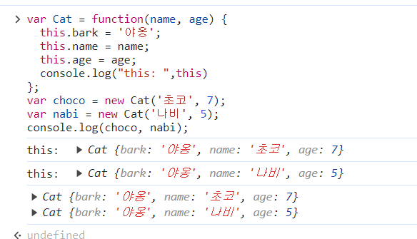
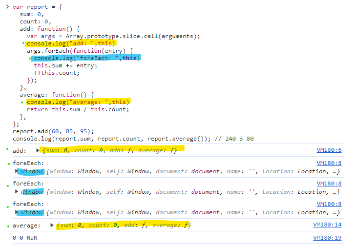

# 3.this

> 함수와 객체(메서드)의 구분이 느슨한 자바스크립트에서 이 둘을 구분하게하는 거의 유일한 기능이다

## 01. 상황에 따라 달라지는 this

자바스크립트에서의 this는 실행 컨텍스트가 생성될 때 함께 결정된다. 실행 컨텍스트는 함수를 호출할 때 생성되므로 **this는 함수가 호출할 때 결정**되는데, 그 함수를 **어떻게** 호출하느냐에 따라서 this의 값이 달라지는 것이다.

### 1) 전역 공간에서의 this

전역공간에서의 this는 전역 객체를 가리킨다. 전역 컨텍스트가 생성하는 주체가 전역 객체이기 때문.

- 브라우저 환경에서의 전역객체는 window
- Node.js 환경에서는 전역객체는 global

전역 변수를 선언하면 자바스크립트 엔진은 이 변수를 전역 객체의 프로퍼티로 할당

```js
var a = 1;
console.log(a); // 1
console.log(window.a); // 1
console.log(this.a); // 1
```

전역공간에서 선언한 변수 a에 1을 할당할 경우 window 객체와 this로 접근이 가능하다.

그 이유는 자바스크립트의 모든 변수는 특정 객체의 프로퍼티로 동작하고 여기서의 특정 객체가 바로 LexicalEnvironment(L.E)이기 때문이다.

어떤 변수를 호출하면 L.E를 조회해서 일치하는 프로퍼티를 찾고 반환함. 전역 컨텍스트의 L.E는 전역객체를 그대로 참조한다.

따라서 전역변수를 선언하면 자바스크립트 엔진은 이를 전역객체의 프로퍼티로 할당하는 것이다.

여기에서 그냥 a를 호출해도 1이 나오는 이유는 스코프체인으로 a를 찾다가 가장 상위에 있는 전역 스코프의 L.E에서 해당 프로퍼티를 발견하여 그 값을 반환하기 때문이다.

이쯤되면 전역 공간에서 var로 변수를 선언하는 것이나 window 객체의 프로퍼티에 직접 값을 할당하는 것이나 똑같이 동작할 것을 예상할 수 있다.

하지만 `delete(삭제)` 명령에서는 똑같이 작동하지 않는다.

```js
var a = 1;
delete window.a; // false
console.log(a, window.a, this.a); // 1 1 1

var b = 2;
delete b; // false
console.log(b, window.b, this.b); // 2 2 2

window.c = 3;
delete window.c; // true
console.log(c, window.c, this.c); // Uncaught ReferenceError: c is not defined

window.d = 4;
delete d; // true
console.log(d, window.d, this.d); // Uncaught ReferenceError: d is not defined
```

예제에서 전역 변수로 선언한 경우(var 사용)에는 `delete`를 시도하면 false로 나온다. 반면 window 객체의 프로퍼티로 직접 할당한 경우(window.)에는 삭제가 가능하다.

이는 사용자의 의도치 않은 삭제를 방지하기 위한 차원이다.

전역 변수를 선언하면 자바스크립트 엔진이 자동으로 전역객체의 프로퍼티로 할당하는데 이 과정에 추가적으로 configurable 속성을(변경 및 삭제 가능성) false로 정의한다.

그렇기 때문에 전역 변수를 활용한 방식에서는 `delete` 명령어를 사용한 삭제는 불가능하다.

<br/>

### 2) 메서드로서 호출할 때 그 메서드 내부에서의 this

함수를 실행하는 방법에는 여러가지가 있다. 가장 일반적인 방법 두가지는 함수로서 호출하는 경우와 메서드로서 호출하는 경우다. 이 둘을 구분하는 차이는 **독립성**으로 이는 함수는 그 자체로서 독립적인 기능을 수행하지만 메서드는 자신을 호출한 대상 객체에 관한 동작을 수행한다는 것이다.

이때 자바스크립트는 상황별로 this키워드에 다른 값을 부여하게 함으로써 이를 구현했다. 흔히들 메서드를 객체의 프로퍼티에 할당된 함수로 이해하는데 이는 완벽하게 맞는 문장이 아니다.

더 정확하게는 **객체의 메서드로서 호출한 경우**에만 메서드이고, 그렇지 않으면 함수다.

```js
var func = function (x) {
  console.log(this, x);
};
func(1); // Window { ... } 1

var obj = {
  method: func,
};
obj.method(2); // { method: f } 2
```

func라는 변수에 익명함수를 할당했다. 이후 func함수를 obj의 method라는 프로퍼티에 할당한 코드다.
이때 이 함수를 직접 호출하면 this는 window를 가리킨다. 반면 obj의 method를 호출하는 방식으로 사용하면 this는 method 객체를 가리키는 것을 확인할 수 있다.

변수에 담아서 호출한 경우와 obj객체의 프로퍼티에 할당하여 호출한 경우 this가 차이를 보이는 것이다.

함수로서의 호출과 메서드로서의 호출은 구분법이 간단하다. 바로 함수 앞에 점(.)이 있는가 없는가에 따라 있으면 메서드, 없으면 함수 호출이다.

점 표기법이든 대괄호 표기법이든 함수를 호출할 때 함수 이름 앞에 객체가 명시되어 있다면 메서드로 호출한 것이다.

this에는 호출한 주체에 대한 정보가 담긴다. 메서드 호출은 해당 메서드를 호출한 주체, 즉 점 앞에 있는 객체가 this가 된다.

```js
var obj = {
  methodA: function () {
    console.log(this);
  },
  inner: {
    methodB: function () {
      console.log(this);
    },
  },
};
obj.methodA(); // { methodA: f, inner: {...} }    ( === obj)
obj['methodA'](); // { methodA: f, inner: {...} } ( === obj)

obj.inner.methodB(); // { methodB: f }            ( === obj.inner)
obj.inner['methodB'](); // { methodB: f }         ( === obj.inner)
obj['inner'].methodB(); // { methodB: f }         ( === obj.inner)
obj['inner']['methodB'](); // { methodB: f }      ( === obj.inner)
```

위의 코드에서 확인할 수 있듯이 메서드에서의 this는 호출한 객체를 가리킨다. obj.에서 methodA를 호출한 경우에는 obj가 this가 되고, obj.inner.에서 호출한 methodB는 obj.inner를 가리킨다.

<br/>

### 3) 함수로서 호출할 때 함수 내부에서의 this

어떤 함수를 함수로서 호출할 경우에는 this가 지정되지 않는다. 함수로서 호출하는 방식은 호출 주체를 명시하지 않고 개발자가 코드에 직접 관여하여 실행하는 것으로 호출 주체의 정보를 알 수 없다. 따라서 실행 컨텍스트를 활성화 하는 과정에서 this가 지정되지 않은 경우에는 this는 전역을 바라보므로 함수에서의 this도 앞서 설명한데로 호출 주체의 정보를 알 수 없기에 전역 객체를 가리키는 것이다.

메서드 내부에서 정의하고 실행한 함수의 this가 가장 혼란스러울 수 있는 부분이다. 하지만 어떤 함수를 메서드로서 호출할 때와 함수로서 호출할 때 this가 무엇을 가리키는지는 .을 통해 알 수 있다.

```js
var obj1 = {
  outer: function () {
    console.log(this);
    var innerFunc = function () {
      console.log(this);
    };
    innerFunc(); //(2)

    var obj2 = {
      innerMethod: innerFunc,
    };
    obj2.innerMethod(); //(3)
  },
};
obj1.outer(); //(1)
```

각각의 함수 및 메서들 호출한 결과는 console로 찍히는 this는 다음과 같다.

(1) obj1

(2) window

(3) obj2

this 바인딩에 관해서는 함수를 실행하는 당시의 주변 환경은 중요하지 않다. 오직 해당 함수를 호출하는 구문 앞에 점 또는 대괄호 표기가 있는지만 중요하다.

obj1의 프로퍼티로서 호출한 outer함수는 메서드로 this는 obj1을 가리킨다. obj2의 프로퍼티로서 호출한 innerMethod 역시 this를 호출한 주체인 ojb2를 가리킨다. 오직 7번줄의 innerFunc()만 this를 window를 가리킨다.

하지만 스코프 체인과의 일관성을 지키는 방식들을 생각하면 함수로서 호출된다고 전역을 가리키는 방식은 다소 아쉽다. 호출 주체가 없을 경우 자동으로 전역객체를 바인딩하지 않고 호출 당시 주변 환경의 this를 상속 받아 사용한다면 좋을 것 같다는 생각이 드는 상황에서 이를 우회하는 방법이 있다.

es5까지는 자체적으로 내부 함수에 this를 바인딩하는 방식이 없지만 우회는 가능하다. 대표적인 방식은 다음과 같이 메서드 내부에서 변수에 this를 바인딩한 뒤 변수를 사용하는 방식이다.

```js
var obj = {
  outer: function () {
    console.log(this); // (1) { outer: f }
    var innerFunc1 = function () {
      console.log(this); // (2) Window { ... }
    };
    innerFunc1();

    var self = this;
    var innerFunc2 = function () {
      console.log(self); // (3) { outer: f }
    };
    innerFunc2();
  },
};
obj.outer();
```

self라는 변수에 this를 바인딩한뒤 innerfunc2에서 this대신 self를 사용한 경우다. 이때는 앞에 .이나 대괄호 없이 함수로서 호출을 하는 방식을 사용해도 전역 객체 대신 outer객체를 가리키고 있는것을 확인할 수 있다.

es5와 달리 es6에서는 this를 바인딩하지 않는 함수로 화살표 함수를 도입했다. 화살표 함수는 실행 컨텍스트를 생성할 때 this 바인딩 과정 자체가 빠지게 되어 상위 스코프의 this를 그대로 사용한다.

이 방식을 사용하면 위에서 설명한 self등의 변수에 this를 할당하여 우회하는 방식을 사용하지 않아도 된다.

```js
var obj = {
  outer: function () {
    console.log(this); // (1) { outer: f }
    var innerFunc = () => {
      console.log(this); // (2) { outer: f }
    };
    innerFunc();
  },
};
obj.outer();
```

<br/>

그 외에도 call, apply 등 메서드를 활용해 명시적으로 this를 지정하는 방식도 있다.

### 4) 콜백 함수 호출 시 그 함수 내부에서의 this

결론부터 말하자면 콜백 함수에서의 this는 함부로 정의할 수 없다. 콜백 함수의 제어권을 가지는 함수(메서드)가 콜백 함수에서의 this를 무엇으로 할지 결정하며 특별히 정의하지 않는 경우에는 기본적으로 전역객체를 바라본다.

콜백함수는 기본적으로는 this가 전역 객체를 참조하지만 제어권을 받은 함수에게서 콜백 함수에 별도로 this가 될 대상을 지정한 경우에는 그 대상을 참조한다.

```js
setTimeout(function () {
  console.log(this);
}, 300); // (1)

[1, 2, 3, 4, 5].forEach(function (x) {
  // (2)
  console.log(this, x);
});

document.body.innerHTML += '<button id="a">클릭</button>';
document.body.querySelector('#a').addEventListener('click', function (e) {
  // (3)
  console.log(this, e);
});
```

setTimeout함수나 forEach는 그 내부에서 콜백 함수를 호출할 때 대상이 될 this를 지정하지 않는다. 그렇기 때문에 함수 내부에서 this가 전역객체를 참조한다.

반면, addEventListner 메서드는 콜백함수를 호출할 때 자신의 this를 상속하도록 정의되어 있다. 그렇기 때문에 .앞인 document.body.querySelector("#a")가 this가 된다.

<br/>

### 5) 생성자 함수 내부에서의 this

생성자 함수는 어떤 공통된 특징을 가진 객체들을 생성하는데 사용되는 함수다. 객체 지향 언어에서 생성자는 class, 클래스를 통해 생성된 객체들을 instance라고 한다. 프로그래밍 적으로 '생성자'는 구체적인 인스턴스를 만들기 위한 일종의 틀이다.

new명령어와 함께 함수를 호출하면 해당 함수가 생성자로서 동작하게 되는데 이처럼 함수가 생성자 함수로 호출되는 경우 내부의 this는 새로 만들어지는 인스턴스 자신을 가리킨다.

```js
var Cat = function (name, age) {
  this.bark = '야옹';
  this.name = name;
  this.age = age;
  console.log(this);
};
var choco = new Cat('초코', 7);
var nabi = new Cat('나비', 5);
console.log(choco, nabi);
```



호출 결과를 확인하면 this는 새롭게 생성된 인스턴스인 자기 자신을 가리키는 것을 확인할 수 있다.

<br/>

## 02. 명시적으로 this를 바인딩하는 방법 this

this에 별도의 대상을 바인딩 하는 방법이 있다

### 1) call 메서드

call 메서드는 메서드의 호출 주체인 함수를 즉시 실행하도록 한다. call메서드의 첫번째 인자에 this로 바인딩할 대상을 넣는다. 이후의 인자들은 호출할 함수의 매개변수가된다.

```js
Function.proptotype.call(thisArg[,arg1[,arg2[,...]]])
```

함수를 그냥 실행한다면 this는 전역객체를 참조하지만 call 메서드를 사용하면 임의의 객체를 this로 지정할 수 있다.

```js
var func = function (a, b, c) {
  console.log(this, a, b, c);
};

// 교재의 코드를 약간 수정했습니다.
const callObj = { x: 1 };

func(1, 2, 3); // Window{ ... } 1 2 3
func.call(callObj, 4, 5, 6); // { x: 1 } 4 5 6
```

다음과 같이 바인딩할 객체를 call의 첫번째 인자로 넣어주면 일반적인 함수호출 방식으로 func를 호출해도 내부의 this는 callObj를 가리키는 것을 확인할 수 있다.

```js
var obj = {
  a: 1,
  method: function (x, y) {
    console.log(this.a, x, y);
  },
};

// 교재의 코드를 약간 수정했습니다.
const callObj = { a: 4 };

obj.method(2, 3); // 1 2 3
obj.method.call(callObj, 5, 6); // 4 5 6
```

여기에서는 메서드 형식으로 호출했기에 원래는 .앞에 있는 호출 주체인 obj를 this가 가리켜야한다. 하지만, call로 callObj를 this에 바인딩 시켜 this가 callObj를 가리키는 것을 확인할 수 있다.

<br/>

### 2) apply 메서드

```js
Function.proptotype.apply(thisArg[,argsArray])
```

apply는 call 메서드와 기능적으로 완전히 동일하다. 차이점은 apply 메서드는 두번째 인자를 배열로 받아 그 배열의 요소들을 호출할 함수의 매개변수로 저장한다는 점이다.

```js
var func = function (a, b, c) {
  console.log(this, a, b, c);
};

// 두번째 인자를 배열로
func.apply({ x: 1 }, [4, 5, 6]); // { x: 1 } 4 5 6

var obj = {
  a: 1,
  method: function (x, y) {
    console.log(this.a, x, y);
  },
};

// 두번째 인자를 배열로
obj.method.apply({ a: 4 }, [5, 6]); // 4 5 6
```

호출할 함수의 매개변수를 하나하나 넘겨주느냐 배열로 넘겨주느냐의 차이만 있을 뿐 call과 동일하게 작동하는 것을 확인할 수 있다.

<br/>

### 3) call/apply 메서드의 활용

**유사배열객체에 배열 메서드 적용시**

기본적으로 객체에는 배열 메서드를 적용할 수 없다. 그러나 키가 0 또는 양의 정수인 프로퍼티가 존재하고, length 프로퍼티의 값이 0 또는 양의 정수인 객체, 즉 배열의 구조와 유사한 객체(유사배열객체)의 경우에는 call 또는 apply를 사용해 배열 메서드를 차용할 수 있다.

```js
var obj = {
  0: 'a',
  1: 'b',
  2: 'c',
  length: 3,
};
Array.prototype.push.call(obj, 'd');
console.log(obj); // { 0: 'a', 1: 'b', 2: 'c', 3: 'd', length: 4 }

var arr = Array.prototype.slice.call(obj);
console.log(arr); // [ 'a', 'b', 'c', 'd' ]
```

여기에서 각각 push와 slice 메서드를 call과 함께 사용한 모습을 확인할 수 있다. 유사배열객체인 obj에 push, slice를 함께 사용하여 해당 객체를 this로 넘겨주어 유사배열 객체에 배열 메서드를 적용시킨것이다.

함수 내부에서 접근할 수 있는 arguments 객체도 유사 배열 객체이므로 위와 같이 전환하여 사용할 수 있다. queryselector, getElementsByClassName등의 Node 선택자로 선택한 결과인 NodeList도 마찬가지다.


```js
function a() {
  var argv = Array.prototype.slice.call(arguments);
  argv.forEach(function(arg) {
    console.log(arg);
  });
}
a(1, 2, 3);
// 1 
// 2 
// 3

document.body.innerHTML = '<div>a</div><div>b</div><div>c</div>';
var nodeList = document.querySelectorAll('div');
var nodeArr = Array.prototype.slice.call(nodeList);

nodeArr.forEach(function(node) {
  console.log(node);
// <div>a</div>
// <div>b</div>
// <div>c</div>
});

```

유사배열객체는 call/apply 메서드를 이용해 모든 배열 메서드를 적용할 수 있으며 배열처럼 인덱스와 length 프로퍼티를 지니는 문자열에도 적용가능하다.

하지만, 문자열의 경우에는 lenght가 읽기 전용이기 때문에 원본 문자열에 변경을 가하는 메서드는 에러를 던진다. concat처럼 반드시 배열이어야 하는 경우에는 에러는 발생하지 않지만 제대로 된 결과를 얻을 수 없다는 점도 참고해야한다.

```js
var str = 'abc def';

Array.prototype.push.call(str, ', pushed string');
// Error: Cannot assign to read only property 'length' of object [object String]

Array.prototype.concat.call(str, 'string'); // [String {"abc def"}, "string"]

Array.prototype.every.call(str, function(char) {
  return char !== ' ';
}); // false

Array.prototype.some.call(str, function(char) {
  return char === ' ';
}); // true

var newArr = Array.prototype.map.call(str, function(char) {
  return char + '!';
});
console.log(newArr); // ['a!', 'b!', 'c!', ' !', 'd!', 'e!', 'f!']

var newStr = Array.prototype.reduce.apply(str, [
  function(string, char, i) {
    return string + char + i;
  },
  '',
]);
console.log(newStr); // "a0b1c2 3d4e5f6"
```

call과 apply를 사용한 형 변환은 본래의 메서드 의도와는 다소 동떨어진 활용법이다. ES6에서는 유사배열객체 또는 순회 가능한 모든 종류의 데이터 타입을 배열로 전환하는 Array.form메서드를 새로 도입했다.

```js
var obj = {
  0: 'a',
  1: 'b',
  2: 'c',
  length: 3,
};
var arr = Array.from(obj);
console.log(arr); // ['a', 'b', 'c']
```


**생성자 내부에서 다른 생성자를 호출**

생성자 내부에 다른 생성자와 공통된 내용이 있는 경우에는 call 또는 apply를 이용해 다른 생성자를 호출하여 반복을 줄일 수 있다.

다음은 예제코드이다.

```js
function Person(name, gender) {
  this.name = name;
  this.gender = gender;
}
function Student(name, gender, school) {
  Person.call(this, name, gender);
  this.school = school;
}
function Employee(name, gender, company) {
  Person.apply(this, [name, gender]);
  this.company = company;
}
var by = new Student('보영', 'female', '단국대');
var jn = new Employee('재난', 'male', '구골');
```

var로 선언된 변수 by를 기준으로 내부 로직을 설명하자면 다음과 같다.

new Student를 사용하여 by라는 인스턴스를 생성할 때 Student 생성자함수 내부의 this는 새롭게 생성된 인스턴스 즉, by를 가리키게 된다.

따라서 Person.call의 this는 by를 가리키고 Person 생성자 함수가 실행되면서 내부의 this.name과 this.gender는 by의 프로퍼티가 되는 것이다.


**여러 인수를 묶어 하나의 배열로 전달하고 싶을 때 - apply 활용**

여러개의 인수를 받는 메서드에게 하나의 배열로 인수를 전달하고 싶을 때 apply 메서드를 사용할 수 있다.

다음은 apply 메서드를 활용하여 배열에서 최대/최솟값을 구하는 방법이다.


```js
var numbers = [10, 20, 3, 16, 45];
var max = Math.max.apply(null, numbers);
var min = Math.min.apply(null, numbers);
console.log(max, min); // 45 3
```

ES6에서는 spread operator를 활용하여 더욱 간편하게 작성할 수 있다.

```js
const numbers = [10, 20, 3, 16, 45];
const max = Math.max(...numbers);
const min = Math.min(...numbers);
console.log(max, min); // 45 3
```

call/apply 메서드는 명시적으로 별도의 this를 바인딩하면서 함수 도는 메서드를 실행하는 훌룡한 방법이지만 오히려 이로 인해 this를 예측하기 어렵게 만든다는 단점이 있다. 하지만 ES5이하의 환경에서는 마땅한 대안이 없어 실무에서 광범위하게 활용되고 있다.

<br/>

### 4) bind 메서드

bind 메서드는 ES5에서 추가된 기능으로 call과 비슷하지만 바로 실행되는 call과 달리 넘겨 받은 this 및 인수들을 바탕으로 새로운 함수를 반환하기만 한다.

이후 새로운 함수를 호출할 때 인수를 넘기면 그 인수들은 기존 bind 메서드를 호출할 때 전달했던 인수들의 뒤에 이어서 등록된다.

```js
var func = function(a, b, c, d) {
  console.log(this, a, b, c, d);
};
func(1, 2, 3, 4); // Window{ ... } 1 2 3 4

var bindFunc1 = func.bind({ x: 1 }); // func에 {x:1}을 this로 바인딩한 새로운 함수

// bindFunc1 호출
bindFunc1(5, 6, 7, 8); // { x: 1 } 5 6 7 8

var bindFunc2 = func.bind({ x: 1 }, 4, 5); // func에 {x:1}을 this로 바인딩하고 a,b 자리에 4와 1을 부여한 새로운 함수

// bindFunc2 호출
bindFunc2(6, 7); // { x: 1 } 4 5 6 7
bindFunc2(8, 9); // { x: 1 } 4 5 8 9
```


**name 프로퍼티**

bind 메서드를 적용하여 새롭게 생성한 함수에는 name 프로퍼티에 동사 'bind'의 수동태인 'bound'가 붙는다는 독특한 성질이 있다. 

어떤 함수의 name 프로퍼티가 'bound xxx'라면 이는 xxx라는 함수에 bind 메서드를 적용한 새로운 함수라는 의미가 된다.

이를 통해 기존으 call이나 apply보다 코드 추적이 더 용이하다는 장점이 있다.

```js
var func = function(a, b, c, d) {
  console.log(this, a, b, c, d);
};
var bindFunc = func.bind({ x: 1 }, 4, 5);
console.log(func.name); // func
console.log(bindFunc.name); // bound func
```


**상위 컨텍스트의 this를 내부함수나 콜백 함수에 전달하기**

변수를 사용하여 this를 우회하는 방식이 아니라 call이나 apply, bind 메서드를 활용한 상위 컨텍스트 this 바인딩은 다음과 같다.


```js
var obj = {
  outer: function() {
    console.log(this);
    var innerFunc = function() {
      console.log(this);
    };
    innerFunc.call(this);
  },
};
obj.outer();


var obj = {
  outer: function() {
    console.log(this);
    var innerFunc = function() {
      console.log(this);
    }.bind(this);
    innerFunc();
  },
};
obj.outer();
```


콜백 함수를 인자로 받는 메서드 중에서도 기본적으로 콜백 함수 내에서의 this에 관여하는 함수 또는 메서드도 bind 메서드를 이용하여 this 값을 변경할 수 있다.


```js
var obj = {
  logThis: function() {
    console.log(this);
  },
  logThisLater1: function() {
    setTimeout(this.logThis, 500);
  },
  logThisLater2: function() {
    setTimeout(this.logThis.bind(this), 1000);
  },
};
obj.logThisLater1(); // Window { ... }
obj.logThisLater2(); // obj { logThis: f, ... }
```

기본적으로 callback함수는 그 콜백함수의 제어권을 가진 함수 this를 어떻게 결정했느냐가 중요하다. 만약 제어권이 명확하지 않은 경우에는 콜백함수의 this는 기본적으로 전역객체를 가리킨다.

따라서 12번째줄은 비록 메서드 형식으로 logThisLater1을 호출했지만 내부의 setTimeout에서의 콜백함수인 this.logThis에서는 this를 따로 바인딩하는 과정이 없기에 전역객체를 참조한다.

반면 13번째줄에서는 호출되는 setTimeout함수를 this와 바인딩하는 것을 확ㅇ니할 수 있다. 이 과정 때문에 상위 객체인 obj를 바인딩하여 출력되는것이다.

<br/>

### 5) 화살표 함수의 예외사항

ES6에 도입된 화살표 함수는 실행컨텍스스 생성 시 this를 바인딩하는 과정이 제외된다. 

화살표 함수 내부에서 this는 존재하지 않으며 접근하고자 하면 스코프체인상 가장 가까운 this에 접근하게 된다.

다음 코드는 내부함수를 화살표 함수로 변경하여 this를 우회하거나 call/apply/bind같은 메서드를 적용하지 않고 스코프 체인상의 this를 가리키는 케이스다.

```js
var obj = {
  outer: function() {
    console.log(this);
    var innerFunc = () => {
      console.log(this);
    };
    innerFunc();
  },
};
obj.outer(); //obj {outer:f}
```

<br/>

### 6) 별도의 인자로 this를 받는 경우(콜백 함수 내에서의 this)

콜백 함수를 인자로 받는 메서드 중 일부는 this를 지정할 객체를 인자로 넘겨줄 수 있는 경우가 있다. 이러한 메서드의 thisArg 값을 지정하면 콜백 함수 내부에서 this 값을 원하는 대로 변경이 가능하다. 주로 배열 메서드에 포진되어 있으며 ES6에서 등장한 Set, Map 등의 메서드에도 일부 존재한다.

다음은 대표적인 배열 메서드인 forEach의 thisArg를 지정한 코드이다.

```js
var report = {
  sum: 0,
  count: 0,
  add: function() {
    var args = Array.prototype.slice.call(arguments);
    console.log("add: ",this)
    args.forEach(function(entry) {
      console.log("foreEach: ",this)
      this.sum += entry;
      ++this.count;
    }, this);// 콜백함수 내부에서 this를 지정 => report {sum:0, ...}
  },
  average: function() {
    console.log("average: ",this)
    return this.sum / this.count;
  },
};
report.add(60, 85, 95);
console.log(report.sum, report.count, report.average()); // 240 3 80
```

로직을 설명하자면 다음과 같다. 먼저 report.add 메서드를 사용하여 인자로 60,85,95를 넘겨준다. 

add메서드 내부에서는 call을 사용해 인자로 받은 세 값을 배열로 변환시키고 이 배열의 인자들을 forEach를 사용해서 순회하게된다.

이때 forEach의 thisArg의 값을 this로 지정하여 report 객체를 바라보게한다. 이러한 바인딩으로 this.sum은 report.sum이 되고, this.count는 report.count가 되어 값이 변경된다. 최종적으로는 report.sum에는 240이, report.count에는 3으로 변경된다.

이후 report.average 메서드를 확인하면 sum을 count로 나눈 80이 반환된다.


> +**만약 thisArg를 인자로 넘겨주지 않고 forEach를 수행한다면?**

콜백함수 내부에서 this는 따로 바인딩이 되지 않는 한 기본적으로 전역객체를 가리킵니다. 따라서 report 객체 내부의 add 함수의 this는 report를 가리키지만, forEach에서 전달한 콜백 함수 내부에서의 this는 전역객체(window)를 가리키는 것을 확인할 수 있습니다.


대표 예시로 forEach를 들었지만 thisArg 인자로 받아 this를 지정하는 메서드는 다음과 같다.

```js
Array.prototype.forEach(callback[, thisArg])
Array.prototype.map(callback[, thisArg])
Array.prototype.filter(callback[, thisArg])
Array.prototype.some(callback[, thisArg])
Array.prototype.every(callback[, thisArg])
Array.prototype.find(callback[, thisArg])
Array.prototype.findIndex(callback[, thisArg])
Array.prototype.flatMap(callback[, thisArg])
Array.prototype.from(arrayLike[, callback[, thisArg]])
Set.prototype.forEach(callback[, thisArg])
Map.prototype.forEach(callback[, thisArg])
```

<br/>

## 03. 정리

**다음은 명시적 this 바인딩이 없는 한 항상 성립되는 규칙이다.**

- 전역공간에서의 this는 전역객체를 참조한다.

- 어떤 함수를 메서드로서 호출한 경우 this는 메서드 호출 주체를 참조한다.

- 어떤 함수를 함수로서 호출한 경우 this는 전역객체를 참조한다. 메서드 내부 함수에서도 동일하게 작동한다.

- 생성자 함수에서의 this는 새롭게 생성되는 instance를 참조한다.

**다음은 명시적 this 바인딩으로 위 규칙에 부합하지 않는 경우에는 다음을 통해 this를 예측할 수 있다.**

- call, apply 메서드는 this를 명시적으로 지정하며 함수 또는 메서드를 바로 호출한다. 

- bind 메서드는 this 및 함수에 넘길 인수를 일부 지정하여 새로운 함수를 반환한다. 호출은 새롭게 반환된 함수를 사용하여 호출한다.

- 요소를 순회하면서 콜백 함수를 호출하는 내용의 일부 메서드는 별도의 인자로 this를 받는다.(thisArg)